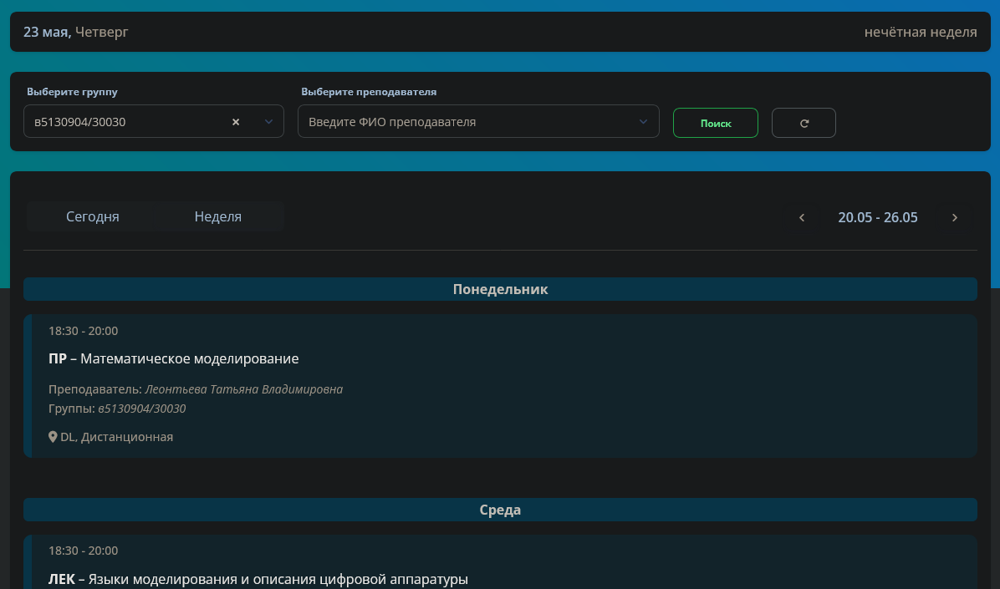
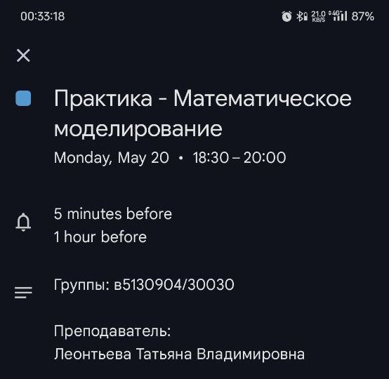

# politech-get-schedule-for-google-calendar

**EN** | [RU](README_RU.md)

## 1. Description

This script download schedule from <https://my.spbstu.ru/> and saves it as `.ics` file for import in Google Calendar.

## 2. Requirements

## 3. Usage

1. Clone the repository:

    ```bash
    git clone https://github.com/Nikolai2038/politech-get-schedule-for-google-calendar.git && \
    cd politech-get-schedule-for-google-calendar
    ```

2. Copy `.env.example` to `.env` and change variables to your needs. To get CSRF token, you need:

    1. Open your browser;
    2. Login at <https://my.spbstu.ru/home/profile/#>;
    3. Open DevTools - by "F12" key, choose "Network" tab;
    4. In the page, click on the "Неделя" tab-button for schedule;
    5. You should see new network request in DevTools. Click on it;
    6. Copy `csrftoken` value and paste it as value to `CSRF_TOKEN` variable.

3. Execute (arguments are optional):

    ```bash
    ./get_schedule.sh [YYYY-MM-DD] [group name]
    ```

    Passed arguments will be prioritized over variables, defined in `.env`.

## 4. Example

For example, we want to add this schedule to Google Calendar:



We need:

1. Get and insert CSRF token in `.env`

2. Execute:

    ```bash
    ./get_schedule.sh "2024-05-22" "5130904/30030"
    ```

    It will output:

    ```text
    JSON successfully saved to "./data/в5130904-30030_2024-05-22.json"!
    JSON successfully converted to "./data/в5130904-30030_2024-05-22.ics"!
    ```

Actual response from server will be saved in `./data/в5130904-30030_2024-05-22.json`:

```json
{
  "list_of_name": [
    [
      "ПР",
      "Практика"
    ],
    [
      "ЛЕК",
      "Лекции"
    ],
    [
      "ЗЧ",
      "Зачет"
    ]
  ],
  "lessons_for_week": [
    [],
    [
      1,
      [
        "18:30 - 20:00",
        "ПР",
        "Математическое моделирование",
        "в5130904/30030",
        "Леонтьева Татьяна Владимировна",
        "DL, Дистанционная"
      ]
    ],
    [
      3,
      [
        "18:30 - 20:00",
        "ЛЕК",
        "Языки моделирования и описания цифровой аппаратуры",
        "в5130904/30030",
        "Амосов Владимир Владимирович",
        "DL, Дистанционная"
      ],
      [
        "20:15 - 21:45",
        "ПР",
        "Языки моделирования и описания цифровой аппаратуры",
        "в5130904/30030",
        "Петров Александр Владимирович",
        "DL, Дистанционная"
      ]
    ],
    [
      5,
      [
        "18:30 - 21:30",
        "ЗЧ",
        "Технологии цифровой промышленности",
        "в5130904/30030",
        "Салкуцан Сергей Владимирович",
        "DL, Дистанционная"
      ]
    ]
  ],
  "date_for_rasp": "20.05 - 26.05",
  "today_date": "2024-05-22"
}
```

Generated ICS file for Google Calendar will be saved in `./data/в5130904-30030_2024-05-22.ics`:

```ics
BEGIN:VCALENDAR
VERSION:2.0
PRODID:-//Your Organization//Your Product//EN
BEGIN:VEVENT
SUMMARY:Практика - Математическое моделирование
DTSTART:20240522T183000
DTEND:20240522T200000
DESCRIPTION:Группы: в5130904/30030\n\nПреподаватель:\nЛеонтьева Татьяна Владимировна
END:VEVENT
BEGIN:VEVENT
SUMMARY:Лекции - Языки моделирования и описания цифровой аппаратуры
DTSTART:20240524T183000
DTEND:20240524T200000
DESCRIPTION:Группы: в5130904/30030\n\nПреподаватель:\nАмосов Владимир Владимирович
END:VEVENT
BEGIN:VEVENT
SUMMARY:Практика - Языки моделирования и описания цифровой аппаратуры
DTSTART:20240524T201500
DTEND:20240524T214500
DESCRIPTION:Группы: в5130904/30030\n\nПреподаватель:\nПетров Александр Владимирович
END:VEVENT
BEGIN:VEVENT
SUMMARY:Зачет - Технологии цифровой промышленности
DTSTART:20240526T183000
DTEND:20240526T213000
DESCRIPTION:Группы: в5130904/30030\n\nПреподаватель:\nСалкуцан Сергей Владимирович
END:VEVENT
END:VCALENDAR
```

Now, if we open copy `.ics` file to the phone and open it, Google Calendar will be opened:


All details about subject are added in event description:



## 5. Contribution

Feel free to contribute via [pull requests](https://github.com/Nikolai2038/politech-get-schedule-for-google-calendar/pulls) or [issues](https://github.com/Nikolai2038/politech-get-schedule-for-google-calendar/issues)!
