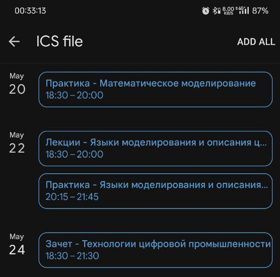

# politech-get-schedule-for-google-calendar

[EN](README.md) | **RU**

## 1. Описание

Этот скрипт позволяет скачать расписание с <https://my.spbstu.ru/> и сохранить его в файле `.ics` для последующего импорта в Google Calendar.

## 2. Требования

## 3. Использование

1. Склонировать репозиторий:

    ```bash
    git clone https://github.com/Nikolai2038/politech-get-schedule-for-google-calendar.git && \
    cd politech-get-schedule-for-google-calendar
    ```

2. Скопировать файл `.env.example` в `.env` и изменить значения переменных в нём под себя. Для получения CSRF токена, необходимо:

    1. Открыть браузер;
    2. Авторизоваться на <https://my.spbstu.ru/home/profile/#>;
    3. Открыть DevTools клавишей "F12", выбрать вкладку "Network";
    4. На веб-странице, нажать на кнопку-вкладку "Неделя" для просмотра расписания;
    5. В DevTools должен появиться новый запрос. Необходимо нажать на него;
    6. Скопировать значения `csrftoken` и вставить его в значение переменной `CSRF_TOKEN`.

3. Выполнить (указанные аргументы необязательны):

    ```bash
    ./get_schedule.sh [YYYY-MM-DD] [название группы]
    ```

    Переданные аргументы имеют приоритет над значениями, указанными в `.env`.

## 4. Пример

Допустим, мы хотим сохранить это расписание в Google Calendar:


Нужно:

1. Получить и вставить CSRF токен в `.env`

2. Выполнить:

    ```bash
    ./get_schedule.sh "2024-05-22" "5130904/30030"
    ```

    Будет выведено:

    ```text
    JSON successfully saved to "./data/в5130904-30030_2024-05-22.json"!
    JSON successfully converted to "./data/в5130904-30030_2024-05-22.ics"!
    ```

Прямой ответ от сервера будет сохранён в файл `./data/в5130904-30030_2024-05-22.json`:

```json
{
  "list_of_name": [
    [
      "ПР",
      "Практика"
    ],
    [
      "ЛЕК",
      "Лекции"
    ],
    [
      "ЗЧ",
      "Зачет"
    ]
  ],
  "lessons_for_week": [
    [],
    [
      1,
      [
        "18:30 - 20:00",
        "ПР",
        "Математическое моделирование",
        "в5130904/30030",
        "Леонтьева Татьяна Владимировна",
        "DL, Дистанционная"
      ]
    ],
    [
      3,
      [
        "18:30 - 20:00",
        "ЛЕК",
        "Языки моделирования и описания цифровой аппаратуры",
        "в5130904/30030",
        "Амосов Владимир Владимирович",
        "DL, Дистанционная"
      ],
      [
        "20:15 - 21:45",
        "ПР",
        "Языки моделирования и описания цифровой аппаратуры",
        "в5130904/30030",
        "Петров Александр Владимирович",
        "DL, Дистанционная"
      ]
    ],
    [
      5,
      [
        "18:30 - 21:30",
        "ЗЧ",
        "Технологии цифровой промышленности",
        "в5130904/30030",
        "Салкуцан Сергей Владимирович",
        "DL, Дистанционная"
      ]
    ]
  ],
  "date_for_rasp": "20.05 - 26.05",
  "today_date": "2024-05-22"
}
```

Сгенерированный файл ICS для Google Calendar будет сохранён в `./data/в5130904-30030_2024-05-22.ics`:

```ics
BEGIN:VCALENDAR
VERSION:2.0
PRODID:-//Your Organization//Your Product//EN
BEGIN:VEVENT
SUMMARY:Практика - Математическое моделирование
DTSTART:20240522T183000
DTEND:20240522T200000
DESCRIPTION:Группы: в5130904/30030\n\nПреподаватель:\nЛеонтьева Татьяна Владимировна
END:VEVENT
BEGIN:VEVENT
SUMMARY:Лекции - Языки моделирования и описания цифровой аппаратуры
DTSTART:20240524T183000
DTEND:20240524T200000
DESCRIPTION:Группы: в5130904/30030\n\nПреподаватель:\nАмосов Владимир Владимирович
END:VEVENT
BEGIN:VEVENT
SUMMARY:Практика - Языки моделирования и описания цифровой аппаратуры
DTSTART:20240524T201500
DTEND:20240524T214500
DESCRIPTION:Группы: в5130904/30030\n\nПреподаватель:\nПетров Александр Владимирович
END:VEVENT
BEGIN:VEVENT
SUMMARY:Зачет - Технологии цифровой промышленности
DTSTART:20240526T183000
DTEND:20240526T213000
DESCRIPTION:Группы: в5130904/30030\n\nПреподаватель:\nСалкуцан Сергей Владимирович
END:VEVENT
END:VCALENDAR
```

Теперь, если мы скопируем файл `.ics` на телефон, и откроем его, Google Calendar будет открыт:



Все детали о предмете добавляются в описание события:


## 5. Развитие

Не стесняйтесь участвовать в развитии репозитория, используя [pull requests](https://github.com/Nikolai2038/politech-get-schedule-for-google-calendar/pulls) или [issues](https://github.com/Nikolai2038/politech-get-schedule-for-google-calendar/issues)!
